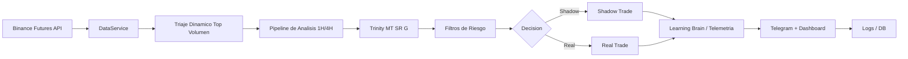

# Pbot V5ARCH DEV

> 🤖 Bot de trading cuantitativo para Binance Futures, orientado a señales 1H con triaje dinamico, filtros estructurales y modo shadow/real.


## 🚀 Resumen rapido

| Modulo | Estado | Descripcion |
|---|---|---|
| 📡 Triaje dinamico | Activo | Escanea top pares por liquidez y mantiene lista viva |
| 🧠 Trinity (MT/SR/G) | Activo | Consenso de tendencia, estructura e IA |
| 🛡️ Filtro SHOCK | Activo | Evita entradas sin espacio operativo |
| 👻 Shadow Mode | Activo | Ejecuta simulacion controlada para aprendizaje |
| 🔒 Real Mode | Activo | Solo con umbral alto de confianza |

## ⚙️ Requisitos

| Requisito | Version |
|---|---|
| Python | 3.10+ |
| Pip | Ultima estable recomendada |
| Dependencias | `requirements.txt` |

## 📦 Instalacion

```bash
python3 -m venv .venv
source .venv/bin/activate
pip install -r requirements.txt
```

## 🔧 Configuracion

1. Crea y ajusta tu `.env` (no versionado).
2. Revisa parametros principales:

| Archivo | Uso |
|---|---|
| `core/config/operational.py` | Escaneo, timeouts, limites de triaje |
| `core/config/strategy.py` | Riesgo, TP/SL, reglas de estrategia |
| `core/config/manager.py` | Umbrales unificados y SHOCK |

## ▶️ Ejecucion

### Modo local

```bash
python3 main.py
```

### Modo servicio (systemd)

```bash
sudo cp sniper-ai.service /etc/systemd/system/sniper-ai.service
sudo systemctl daemon-reload
sudo systemctl enable sniper-ai.service
sudo systemctl restart sniper-ai.service
sudo systemctl status sniper-ai.service --no-pager
```

## 🖥️ Operacion diaria

| Tarea | Comando |
|---|---|
| Ver estado del servicio | `sudo systemctl status sniper-ai.service --no-pager` |
| Reiniciar bot | `sudo systemctl restart sniper-ai.service` |
| Detener bot | `sudo systemctl stop sniper-ai.service` |
| Logs systemd en vivo | `journalctl -u sniper-ai.service -f` |
| Logs del bot en vivo | `tail -f sniper.log` |

## 📊 Lectura rapida del radar

| Indicador | Significado |
|---|---|
| `⛔ VETO: SHOCK DEMASIADO CERCA` | Hay poco espacio al siguiente nivel estructural |
| `🔌 LATENCIA` | El fetch del par fue lento y entro en cuarentena temporal |
| `⏱️ TIMEOUT HILO` | El hilo no termino dentro del timeout del ciclo |
| `❌ ERR: SIZE_ERROR` | El sizing no dio un notional/cantidad valida |

## 🧯 Quick Troubleshooting

| Problema visible | Causa probable | Accion recomendada |
|---|---|---|
| Muchos `🔌 LATENCIA` | Timeout agresivo o API lenta | Revisar timeout de triaje y carga concurrente |
| `⏱️ TIMEOUT HILO` frecuente | Hilos no completan en ventana del ciclo | Aumentar timeout o reducir retries |
| `❌ ERR: SIZE_ERROR` | Precision/min notional del simbolo | Revisar sizing y reglas de lote/notional |
| Todo queda en `50%` | Agentes neutralizados o IA sin boost | Verificar modelos de Ghost y votos MT/SR |
| Casi todo veta por SHOCK | Distancia minima muy estricta | Calibrar `SHOCK_MIN_DIST_PCT` con datos reales |

## 🗺️ Roadmap

| Fase | Objetivo | Estado |
|---|---|---|
| Fase 1 | Baseline y telemetria | ✅ Completado |
| Fase 2 | Trinity + limpieza de deuda tecnica | ✅ Completado |
| Fase 3 | Triaje dinamico top volumen | ✅ Completado |
| Fase 4 | Integracion SHOCK y hardening | ✅ Completado |
| Fase 5 | Optimizacion continua y tuning live | 🔄 En progreso |

## 🔐 Seguridad del repositorio

- Nunca subas `.env`, DBs, logs ni modelos binarios.
- El `.gitignore` ya bloquea artefactos locales comunes.
- Usa tokens de GitHub, no contrasenas, para autenticacion CLI.

## 🧭 Estructura del proyecto

| Ruta | Contenido |
|---|---|
| `main.py` | Orquestacion principal del bot |
| `core/` | Motor de estrategia, riesgo, ejecucion y datos |
| `tools/` | Utilidades de auditoria, reportes y entrenamiento |
| `sniper-ai.service` | Servicio systemd listo para despliegue |

## 🏗️ Arquitectura (alto nivel)



## 🤖 Comandos Telegram utiles

| Comando | Funcion |
|---|---|
| `/targets` | Muestra objetivos activos del radar |
| `/shadow_report` | Reporte de rendimiento shadow |
| `/paper_review` | Resumen de desempeño paper/real |
| `/performance_trends` | Eficiencia por tipo de mercado |
| `/trade <id>` | Detalle completo de un trade por ID |
| `/trade_detail <symbol>` | Analisis del simbolo en radar |
| `/dna <symbol>` | Estado genetico de parametros por simbolo |
| `/explain <symbol>` | Explicacion IA de la decision |
| `/reset` | Reinicio de PnL diario |
| `/archive` | Rotacion/archivo de historial DB |

## 🖼️ Vista sugerida del repositorio

Puedes agregar una captura del dashboard para mejorar la portada:

```md

```

Ruta sugerida:

- `docs/images/dashboard.png`

## 📚 Documentacion adicional

| Documento | Proposito |
|---|---|
| `CONTRIBUTING.md` | Guia de contribucion y checklist de validacion |
| `SECURITY.md` | Politica de seguridad y reporte de vulnerabilidades |
| `.github/PULL_REQUEST_TEMPLATE.md` | Plantilla estandar para PRs |
| `.github/ISSUE_TEMPLATE/` | Plantillas para bugs y mejoras |
