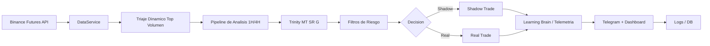

# Pbot V5ARCH DEV

> 🤖 Bot de trading cuantitativo para Binance Futures, orientado a señales 1H con triaje dinamico, filtros estructurales y modo shadow/real.


## 🚀 Resumen rapido

| Modulo | Estado | Descripcion |
|---|---|---|
| 📡 Triaje dinamico | Activo | Escanea top pares por liquidez y mantiene lista viva |
| 🧠 Trinity (MT/SR/G) | Activo | Consenso de tendencia, estructura e IA |
| 🛡️ Filtro SHOCK | Activo | Evita entradas sin espacio operativo |
| 👻 Shadow Mode | Activo | Ejecuta simulacion controlada para aprendizaje |
| 🔒 Real Mode | Activo | Solo con umbral alto de confianza |

## 🆕 Novedades recientes (Abr 2026)

- Refactor modular masivo: `main.py` paso de monolito a entrypoint minimalista.
- Nueva capa de aplicacion en `core/bot_app.py` y fachada en `core/bot_facade.py`.
- Optimización de Salidas: Desactivación de TP estáticos (TP1/TP2) para priorizar Trailing ATR dinámico y reversión de confianza IA (`DEGRADED_CONFIDENCE`), permitiendo capturar tendencias más extensas.
- CI reforzado en GitHub Actions: compilacion, smoke imports, guardrail anti-`pass`, contratos arquitectonicos.
- Suite de regresion runtime incorporada en `tests/`.
- Hardening de errores: reemplazo sistematico de `pass` silenciosos por rutas con trazabilidad.
- Reconciliacion de arranque: modulo `core/reconciliation.py` con adopcion de huerfanas, deteccion `LOST_IN_TRANSMISSION` e `Integrity Lock` por desbalance de capital.
- Capa de ejecucion agnostica por adaptadores: `core/execution_adapters.py` permite backend `live` o `shadow_live` sin contaminar la logica de negocio.

### Contrato de estados de orden/trade (runtime)

- `PENDING_SEND`: intencion persistida en SQLite antes de enviar orden al exchange.
- `PENDING_EXCHANGE_OPEN`: orden detectada abierta en exchange por `client_order_id`.
- `ENTRY_FILLED_AWAITING_POSITION_SYNC`: entrada detectada como `FILLED`, esperando que la posicion aparezca en `fetch_positions`.
- `OPEN`: posicion activa y gestionada por bucles de riesgo/guardian.
- `CLOSING_INITIATED`: cierre en progreso; el Guardian y monitor de trades no deben mutar ni re-gestionar este trade.

Reglas de reconciliacion en arranque:

- `LOST_IN_TRANSMISSION` solo se declara si el simbolo no aparece ni en posiciones activas ni en ordenes abiertas, y tampoco se recupera por consulta explicita `origClientOrderId`.
- Si existe posicion real sin `HARD SL` en exchange, el bot intenta re-adjuntar SL.
- Si el exchange rechaza el SL por gap de precio (p.ej. `would trigger immediately`, `-2021`), se ejecuta `Emergency Market Close` inmediato para evitar posicion desnuda.

## ⚙️ Requisitos

| Requisito | Version |
|---|---|
| Python | 3.10+ |
| Pip | Ultima estable recomendada |
| Dependencias | `requirements.txt` |

Variables opcionales para Shadow Live:

- `EXECUTION_BACKEND=shadow_live` para simular ejecucion con latencia/rechazo/fill parcial.
- `SHADOW_SIM_LATENCY_MIN_MS`, `SHADOW_SIM_LATENCY_MAX_MS`
- `SHADOW_SIM_REJECT_RATE`, `SHADOW_SIM_PARTIAL_FILL_RATE`, `SHADOW_SIM_PARTIAL_COMPLETE_RATE`, `SHADOW_SIM_MIN_PARTIAL_RATIO`

Variables opcionales operativas (portabilidad/retencion):

- `WATCHDOG_HEARTBEAT_PATH` (default: `/dev/shm/sniper_ai_heartbeat.json`, fallback automatico a `/tmp/...`)
- `RUNTIME_METRICS_MAX_BYTES`, `RUNTIME_METRICS_BACKUPS`
- `EXECUTION_EVENTS_MAX_BYTES`, `EXECUTION_EVENTS_BACKUPS`
- `PENDING_SEND_STALE_SECONDS` (default: `90`) para expirar intenciones huérfanas tras reinicio

Telemetria estructurada de ejecucion:

- Archivo `logs/execution_events.jsonl` (JSONL consultable).
- Eventos clave: `ENTRY_ORDER_ACK`, `PARTIAL_FILL_COMPLETED`, `PARTIAL_FILL_TIMEOUT_CANCEL`, `PARTIAL_FILL_CANCEL_FAILED`, `EMERGENCY_CLOSE_EXECUTED`, `EMERGENCY_CLOSE_FAILED_HALT`.
- Campos utiles para auditoria: slippage simulado (`requested_price` vs `avg_fill_price`), `ttr_seconds` en cierres de emergencia, y coherencia de cantidades (`requested_amount`, `filled_amount`, `remaining_amount`).

Nota de concurrencia en `shadow_live`:

- La latencia simulada no bloquea el hilo llamador de `TradeManager`; el adaptador usa tareas en segundo plano para completar fills parciales.

Inyector de estrés determinista:

```bash
python3 tools/shadow_stress_injector.py --minutes 1 --orders-per-minute 20 --workers 12 --seed 2026
```

## 📦 Instalacion

```bash
python3 -m venv .venv
source .venv/bin/activate
pip install -r requirements.txt
```

## 🔧 Configuracion

1. Crea y ajusta tu `.env` (no versionado).
2. Revisa parametros principales:

| Archivo | Uso |
|---|---|
| `core/config/operational.py` | Escaneo, timeouts, limites de triaje |
| `core/config/strategy.py` | Riesgo, TP/SL, reglas de estrategia |
| `core/config/manager.py` | Umbrales unificados y SHOCK |

## ▶️ Ejecucion

### Modo local

```bash
python3 main.py
```

### Modo servicio (systemd)

```bash
sudo cp sniper-ai.service /etc/systemd/system/sniper-ai.service
sudo systemctl daemon-reload
sudo systemctl enable sniper-ai.service
sudo systemctl restart sniper-ai.service
sudo systemctl status sniper-ai.service --no-pager
```

Plantillas portables (recomendado para VPS multi-entorno):

- `deploy/systemd/sniper-ai.service.template`
- `deploy/systemd/sniper-ai-watchdog.service.template`

Reemplaza en esas plantillas: `{{USER}}`, `{{WORKDIR}}`, `{{PYTHON_BIN}}`, `{{HEARTBEAT_PATH}}`.

Runbook SRE de recovery temporal e intenciones:

- `docs/runbooks/sre-intent-recovery.md`

### Watchdog externo (recomendado)

```bash
sudo cp sniper-ai-watchdog.service /etc/systemd/system/sniper-ai-watchdog.service
sudo cp sniper-ai-watchdog.timer /etc/systemd/system/sniper-ai-watchdog.timer
sudo systemctl daemon-reload
sudo systemctl enable sniper-ai-watchdog.timer
sudo systemctl restart sniper-ai-watchdog.timer
sudo systemctl status sniper-ai-watchdog.timer --no-pager
```

## 🖥️ Operacion diaria

| Tarea | Comando |
|---|---|
| Ver estado del servicio | `sudo systemctl status sniper-ai.service --no-pager` |
| Reiniciar bot | `sudo systemctl restart sniper-ai.service` |
| Detener bot | `sudo systemctl stop sniper-ai.service` |
| Logs systemd en vivo | `journalctl -u sniper-ai.service -f` |
| Logs del bot en vivo | `tail -f sniper.log` |
| Estado timer watchdog | `sudo systemctl status sniper-ai-watchdog.timer --no-pager` |
| Últimos eventos watchdog | `journalctl -u sniper-ai-watchdog.service -n 50 --no-pager` |

## 📊 Lectura rapida del radar

| Indicador | Significado |
|---|---|
| `⛔ VETO: SHOCK DEMASIADO CERCA` | Hay poco espacio al siguiente nivel estructural |
| `🔌 LATENCIA` | El fetch del par fue lento y entro en cuarentena temporal |
| `⏱️ TIMEOUT HILO` | El hilo no termino dentro del timeout del ciclo |
| `❌ ERR: SIZE_ERROR` | El sizing no dio un notional/cantidad valida |

## 🧯 Quick Troubleshooting

| Problema visible | Causa probable | Accion recomendada |
|---|---|---|
| Muchos `🔌 LATENCIA` | Timeout agresivo o API lenta | Revisar timeout de triaje y carga concurrente |
| `⏱️ TIMEOUT HILO` frecuente | Hilos no completan en ventana del ciclo | Aumentar timeout o reducir retries |
| `❌ ERR: SIZE_ERROR` | Precision/min notional del simbolo | Revisar sizing y reglas de lote/notional |
| Todo queda en `50%` | Agentes neutralizados o IA sin boost | Verificar modelos de Ghost y votos MT/SR |
| Casi todo veta por SHOCK | Distancia minima muy estricta | Calibrar `SHOCK_MIN_DIST_PCT` con datos reales |

## 🗺️ Roadmap

| Fase | Objetivo | Estado |
|---|---|---|
| Fase 1 | Baseline y telemetria | ✅ Completado |
| Fase 2 | Trinity + limpieza de deuda tecnica | ✅ Completado |
| Fase 3 | Triaje dinamico top volumen | ✅ Completado |
| Fase 4 | Integracion SHOCK y hardening | ✅ Completado |
| Fase 5 | Optimizacion continua y tuning live | 🔄 En progreso |

## 🔐 Seguridad del repositorio

- Nunca subas `.env`, DBs, logs ni modelos binarios.
- El `.gitignore` ya bloquea artefactos locales comunes.
- Usa tokens de GitHub, no contrasenas, para autenticacion CLI.

## 🧭 Estructura del proyecto

| Ruta | Contenido |
|---|---|
| `main.py` | Entrypoint minimalista (launcher) |
| `core/bot_app.py` | Bootstrap y clase `Bot` principal |
| `core/bot_facade.py` | Fachada unificada de runtime/senales/riesgo |
| `core/reconciliation.py` | Reconciliacion determinista DB/Exchange al arranque |
| `core/` | Motor de estrategia, riesgo, ejecucion y datos |
| `tests/` | Regresiones de runtime y contratos basicos |
| `tools/` | Utilidades de auditoria, reportes y entrenamiento |
| `sniper-ai.service` | Servicio systemd listo para despliegue |

## ✅ Calidad automatica (CI)

Pipeline en `.github/workflows/ci.yml` ejecuta en cada PR/push:

1. `python -m compileall` para validar sintaxis.
2. `scripts/smoke_modular_imports.sh` para detectar roturas de arquitectura modular.
3. `tools/check_no_silent_pass.py` para bloquear `pass` silenciosos en `core/`.
4. `tools/regression_contracts.py` para contratos arquitectonicos.
5. `python -m unittest discover -s tests -p "test_*.py"` para regresion runtime.

## 🏗️ Arquitectura (alto nivel)



## 🤖 Comandos Telegram utiles

| Comando | Funcion |
|---|---|
| `/targets` | Muestra objetivos activos del radar |
| `/shadow_report` | Reporte de rendimiento shadow |
| `/paper_review` | Resumen de desempeño paper/real |
| `/performance_trends` | Eficiencia por tipo de mercado |
| `/trade <id>` | Detalle completo de un trade por ID |
| `/trade_detail <symbol>` | Analisis del simbolo en radar |
| `/dna <symbol>` | Estado genetico de parametros por simbolo |
| `/explain <symbol>` | Explicacion IA de la decision |
| `/reset` | Reinicio de PnL diario |
| `/rebase_capital` | Reancla balance local al exchange y libera Integrity Lock |
| `/archive` | Rotacion/archivo de historial DB |

## 🖼️ Vista sugerida del repositorio

Puedes agregar una captura del dashboard para mejorar la portada:

```md

```

Ruta sugerida:

- `docs/images/dashboard.png`

## 📚 Documentacion adicional

| Documento | Proposito |
|---|---|
| `CONTRIBUTING.md` | Guia de contribucion y checklist de validacion |
| `SECURITY.md` | Politica de seguridad y reporte de vulnerabilidades |
| `.github/PULL_REQUEST_TEMPLATE.md` | Plantilla estandar para PRs |
| `.github/ISSUE_TEMPLATE/` | Plantillas para bugs y mejoras |
