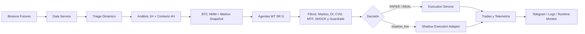
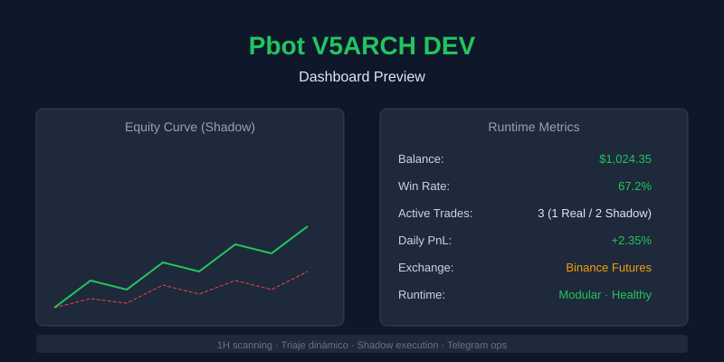

# Pbot V5ARCH DEV

> Bot cuantitativo runtime-first para Binance Futures con HMM Markov, escaneo dinámico 1H, ejecución segura, shadow lab y reconciliación defensiva.


**Bot de trading con enfoque runtime-first: decisión, ejecución, reconciliación y observabilidad en una arquitectura modular.**

`v118.6-PRO` • `Phase 15` • `MTF regime-aware filter` • `Dynamic spread veto per regime` • `Regime tuning enabled by default` • `1H owner + 15m/5m MTF filter` • `BTC HMM + Markov probabilities` • `OI Delta + CVD order flow` • `Correlation risk sizing` • `Regime SL/TP tuning` • `MARKET order fallback` • `CycleContext` • `IntentDeduper` • `CandleCloseCache` • `Unified risk policy` • `Threshold governance` • `Promotion gate` • `Telegram ops` • `systemd` • `Docker`

---

## 🚀 Para Inversores y Colaboradores

### 📈 Propuesta de Valor

- Bot de trading cuantitativo diseñado para operar Binance Futures con enfoque en seguridad runtime y arquitectura modular.
- Escaneo dinámico de mercado en 1H con contexto macro 4H, régimen HMM de BTC y filtros estructurales.
- Separación clara entre lógica de decisión y ejecución, con adaptadores para modos reales y simulados.
- Protección de posiciones reales mediante reconciliación, `HARD SL` y cierres de emergencia.

### ⚡ Ventaja Operativa

| Característica | Descripción |
|---|---|
| 🧬 Markov regime | BTC HMM publica probabilidades de transición y regula la confianza IA sin bloquear el Guardian |
| 👻 Shadow lab | Hasta `20` operaciones shadow concurrentes para explorar sin tocar capital real |
| 🧱 Tactical matrix | Matriz táctica exige muestra válida antes de bloquear símbolos |
| 🛡️ OI Delta filter | Veta short squeezes y long liquidations antes de ejecución |
| 🧭 MTF filter | Confirma/veta entradas con `15m/5m` sin quitar ownership al timeframe `1h`; modo pullback (0.75) si régimen macro alinea pero 15m opone |
| 📉 Correlation risk | Reduce position size cuando posiciones abiertas se mueven como una sola apuesta sistémica |
| 🔬 CVD order flow | Usa agresores `aggTrade` para detectar presión compradora/vendedora real |
| 🧪 Regime tuning | Ajusta SL/TP por régimen con mínimos de muestra y rangos conservadores; activado por defecto con MIN_TRADES=20 |
| 💰 Spread dinámico | Umbral de spread veto se adapta por régimen: BULL 0.10%, BEAR 0.08%, RANGE 0.05% |
| 🧾 Audit trail | Eventos JSONL para señal, filtro, intención, fill y protección |
| 📡 Live data | BTC por websocket con fallback REST y logging explícito de reconexión |

### 🏗️ Arquitectura en Resumen



### 🔍 Lo Más Destacado

| Área | Descripción |
|---|---|
| 📡 Triage dinámico | Escanea pares por liquidez, spread, volumen y latencia |
| 🧠 Motor multi-agente | Combina votos `MT`, `SR` y `G` para la decisión final |
| 🧬 HMM Markov | Clasifica BTC y calcula transición probable a `BULL_TREND`, `BEAR_TREND` o `RANGE` |
| 🛡️ OI Delta | Compara precio reciente vs Open Interest para vetar squeezes/liquidaciones falsas |
| 🧭 MTF 15m/5m | `15m` puede vetar conflicto de setup; `5m` solo ajusta timing/confianza; régimen-aware: pullback 0.75 si macro alinea pero 15m opone |
| 🔬 CVD order flow | CVD rolling por `aggTrade`, boost/penalty conservador sin veto duro inicial |
| 📉 Correlación dinámica | Size reducer por correlación media contra posiciones abiertas |
| 🧪 Auto-tuning régimen | Multiplicadores SL/TP por régimen con mínimos de muestra y límites duros |
| 🛡️ Seguridad runtime | Reconciliación, `HARD SL`, guardrails y cierre de emergencia |
| 👻 Shadow execution | Simula rechazos, slippage y fills parciales con backend separado |
| 📲 Operación remota | Control, auditoría y diagnóstico vía comandos Telegram |
| 🐳 Despliegue | Ejecución local, `systemd` user y Docker |

### Fases de Hardening Runtime

| Fase | Descripción | Estado |
|---|---|---|
| 1 | Circuit Breaker diario UTC solo para `REAL` | ✅ |
| 2 | Position sizing por distancia al `Stop Loss` | ✅ |
| 3 | Validación walk-forward para modelos | ✅ |
| 4 | Market Breadth interno con veto de LONG en `FEAR` | ✅ |
| 5 | Filtro macro HMM, telemetría de pipeline y eventos de ciclo de ejecución | ✅ |
| 6 | Exploración shadow ampliada, matriz táctica validada y limpieza de alertas pendientes | ✅ |
| 7 | HMM Markov como regulador probabilístico de `REAL`, `SHADOW` y `VETO` | ✅ |
| 8 | Dead zone Markov pasa de veto total a penalización estándar | ✅ |
| 9 | Escudo de liquidez: spread máximo 0.05% y radar concentrado en 30 pares | ✅ |
| 10 | Filtro OI Delta para vetar short squeezes y long liquidations | ✅ |
| 11 | `v118.4-PRO`: límite de triaje aplicado end-to-end a snapshot, radar y `pairs_to_scan` | ✅ |
| 12 | Optimización `SCAN_INTERVAL=300` para timeframe 1H (reduce llamadas API de 60→12/hora) | ✅ |
| 12.1 | Correlación dinámica como reducer de tamaño, no veto duro | ✅ |
| 12.2 | Auto-tuning SL/TP por régimen con mínimos de muestra y rangos conservadores | ✅ |
| 12.3 | CVD / Order Flow por WebSocket `aggTrade` como boost/penalty conservador | ✅ |
| 13 | `v118.5-PRO`: MARKET order fallback, CycleContext, IntentDeduper, CandleCloseCache, unified risk policy, threshold governance, promotion gate, REAL pilot | ✅ |
| 14 | Refactorización: emergencia close unificado, endurecimiento config, eliminación código muerto, fix mock leak en tests | ✅ |
| 15 | MTF regime-aware (pullback 0.75 en BULL/BEAR), spread dinámico por régimen, REGIME_TUNING activado por defecto con MIN_TRADES=20 | ✅ |

---

## 📊 Dashboard Preview



---

## 🚀 Inicio Rápido

```bash
# Clonar, preparar entorno y arrancar
git clone https://github.com/Rukawua26/Pbot-V5ARCH-DEV.git
cd Pbot-V5ARCH-DEV
python3 -m venv .venv
source .venv/bin/activate
pip install -r requirements.txt

# Crear .env con tus variables antes de arrancar
./.venv/bin/python main.py
```

Antes de arrancar, crea `.env` manualmente con tus variables operativas y credenciales según el modo que vayas a usar. Para operación real, sigue `docs/runbooks/real-trading.md` y `docs/runbooks/recovery.md`; si no puedes completar esos checks, no uses `REAL`.

---

## 🧭 Navegación Rápida

| Ir a | Sección |
|---|---|
| Inicio rápido | [Inicio Rápido](#-inicio-rápido) |
| Modos de operación | [Modos Operativos](#-modos-operativos) |
| Arquitectura | [Arquitectura](#-arquitectura) |
| Seguridad | [Seguridad Runtime](#-seguridad-runtime) |
| Comandos | [Comandos Telegram](#-comandos-telegram) |
| Validación | [Validación Mínima](#-validación-mínima) |

---

## 📡 Capacidades Actuales

| Área | Estado | Detalle |
|---|---|---|
| Runtime modular | ✅ Activo | `Bot`, `BotFacade`, ciclos, IO loops y monitorización desacoplados |
| Triage dinámico | ✅ Activo | Top pares por liquidez, spread, volumen y latencia |
| Motor de señales | ✅ Activo | Análisis 1H, veto macro 4H, votos de agentes y decisión final |
| Filtro régimen BTC | ✅ Activo | HMM dinámico con fallback heurístico, penalización/range veto y pesos por régimen |
| Spread dinámico | ✅ Activo | Umbral de spread veto se adapta por régimen HMM: BULL 0.10%, BEAR 0.08%, RANGE 0.05% |
| Filtro OI Delta | ✅ Activo | Open Interest externo con cache TTL para vetar short squeezes y long liquidations |
| Filtro MTF | ✅ Disponible | Confirmación `15m/5m` sobre señal dueña `1h`, con eventos `MTF_FILTER`; régimen-aware: pullback 0.75 si macro alinea pero 15m opone |
| Filtro CVD | ✅ Disponible | CVD rolling por agresores `aggTrade`, sin veto duro inicial |
| Riesgo correlación | ✅ Disponible | Reduce size cuando el candidato está altamente correlacionado con posiciones abiertas |
| Auto-tuning régimen | ✅ Disponible | Ajusta SL/TP por régimen usando estadísticas persistidas y límites conservadores |
| Shadow exploration | ✅ Activo | Límite default `MAX_SHADOW_TRADES=20` con override por `.env` |
| Matriz táctica | ✅ Activo | Excluye `VETO_ERROR` y requiere muestra válida antes de bloquear/reducir símbolos |
| Breakout watchlist | ✅ Activo | Seguimiento pasivo/semi-activo de oportunidades vetadas o en espera |
| Exit engine | ✅ Activo | Salidas dinámicas, trailing ATR, breakeven y degradación de confianza |
| Reconciliación | ✅ Activo | Recovery DB/exchange, intents, huérfanas, `LOST_IN_TRANSMISSION` |
| Ejecución segura | ✅ Activo | `HARD SL`, cierres de emergencia, MARKET order fallback y protecciones de runtime |
| Seguridad operativa | ✅ Activo | Modo REAL bloqueado por defecto; requiere `ALLOW_REAL_TRADING=true` explícito + guardrails |
| Telemetría | ✅ Activo | `logs/execution_events.jsonl`, runtime metrics, scorecards y metrics export |
| Operación remota | ✅ Activo | Comandos Telegram para auditoría, inteligencia y control |
| CycleContext | ✅ Activo | Snapshot inmutable por ciclo de scan usando frozen dataclass |
| IntentDeduper | ✅ Activo | Dedup a nivel de señal por ventana de tiempo |
| CandleCloseCache | ✅ Activo | Cache de velas por namespace/símbolo para features |
| Threshold governance | ✅ Activo | `ThresholdSpec` con 30+ umbrales tipados y metadata |
| Risk policy | ✅ Activo | `EntryRiskDecision`, `record_risk_decision`, `evaluate_runtime_entry_decision` |
| Metrics export | ✅ Activo | `logs/metrics_summary.json` con datos de runtime periódicos |
| Promotion gate | ✅ Activo | `tools/promotion_gate.py` — gate compuesto SHADOW→REAL |
| Strategy validation | ✅ Activo | Walk-forward + ablation + regime scorecard + validation report |
| Chaos matrix | ✅ Activo | 6 escenarios de caos validados con `tests/test_chaos_matrix.py` |
| REAL pilot | ✅ Activo | Bot operando en Binance Futures con $24.90 USDT, riesgo 0.3%/trade |
| Docker/systemd | ✅ Disponible | Despliegue en VPS o contenedor |

---

## 🧬 Markov Intelligence Layer

El bot ya no trata el régimen `RANGE` como un interruptor ciego. El HMM publica un snapshot Markov en memoria con probabilidades de transición y la capa de filtros usa ese snapshot como regulador de volumen sobre la confianza IA.

| Señal Markov | Acción |
|---|---|
| `RANGE` + breakout alto | Penalización leve, permite que una señal fuerte llegue a `REAL` o `SHADOW` |
| `RANGE` estándar | Penalización media, normalmente degrada a `SHADOW` |
| `RANGE` estancado | Penalización estándar, no veto total, para no bloquear señales válidas |
| Tendencia alineada fresca | Boost controlado a la probabilidad final |
| Snapshot stale | Solo puede penalizar; no puede boostear riesgo real |

Snapshot runtime ejemplo:

```json
{
  "state": "RANGE",
  "confidence": 0.72,
  "bullish_breakout_prob": 82.0,
  "bearish_reversal_prob": 12.0,
  "range_prob": 6.0,
  "model_version": "hmm_markov_v1"
}
```

Observabilidad:

- `/pipeline` muestra estado Markov, edad del snapshot y contadores de decisiones.
- `logs/execution_events.jsonl` registra `MARKOV_REGIME_DECISION` cuando Markov modifica el comportamiento.
- `system_meta["hmm_markov_snapshot"]` conserva el último snapshot para auditoría y restart.

---

## 🎮 Modos Operativos

| Modo | Configuración | Comportamiento |
|---|---|---|
| `PAPER` | `PAPER_MODE=true` | Usa capital virtual. Si hay credenciales, valida conectividad; si no, puede seguir con endpoints públicos. |
| `REAL` | `PAPER_MODE=false` | Requiere credenciales y permisos válidos de Binance Futures; errores de auth/permisos abortan el arranque. |
| `shadow_live` | `EXECUTION_BACKEND=shadow_live` | Mantiene runtime real pero simula latencia, rechazo, slippage y fills parciales. |
| `TESTNET` | `USE_TESTNET=true` | Activa sandbox cuando el backend lo soporta; en `PAPER` puede degradar a mercado público real para lecturas. |

---

## 🏗️ Arquitectura

### Runtime

```
main.py
  -> core.bot_app.run_entrypoint()
     -> Bot(BotFacade)
        -> bootstrap de servicios, modelos, runtime state y loops
```

### Módulos Clave

| Ruta | Rol |
|---|---|
| `main.py` | Entrypoint real del proceso |
| `core/bot_app.py` | Bootstrap pesado, clase `Bot`, event loop y wiring principal |
| `core/bot_facade.py` | Contrato público del runtime |
| `core/bot_connection.py` | Conexión a Binance y reglas por modo operativo |
| `core/bot_shutdown.py` | Graceful shutdown sequence con HARD SL survival |
| `core/reconciliation.py` | Recovery de estado DB/exchange al arranque |
| `core/execution_adapters.py` | Backends `live` y `shadow_live` |
| `core/execution_service.py` | Puerto de ejecución contra exchange |
| `core/execution_telemetry.py` | Eventos JSONL de ejecución |
| `core/trade_entry.py` | `execute_order` (refactorizado desde trade_manager) |
| `core/trade_exit.py` | `close_trade` (refactorizado desde trade_manager) |
| `core/trade_helpers.py` | Cierre de emergencia unificado, fallos seguros, MARKET fallback, precondiciones |
| `core/risk_engine.py` | RiskEngine, daily drawdown, sizing |
| `core/risk_policy.py` | `EntryRiskDecision`, `evaluate_runtime_entry_decision` |
| `core/cycle_context.py` | Snapshot de ciclo congelado por scan |
| `core/intent_deduper.py` | Dedup de señales por ventana temporal |
| `core/candle_close_cache.py` | Cache de velas por namespace |
| `core/metrics_export.py` | Export periódico a `metrics_summary.json` |
| `core/config/thresholds.py` | `ThresholdSpec` con 30+ umbrales |
| `core/bot_guardian.py` | Vigilancia y protecciones sobre posiciones activas |
| `core/bot_wallet_sync.py` | Sincronización de wallet y capital |
| `core/bot_market_state.py` | Detección de régimen BTC HMM/heurística |
| `core/command_router.py` | Router de comandos Telegram |
| `core/signals/` | Contexto, análisis, filtros y ejecución de señales |
| `core/strategy/` | Agentes, consenso y filtros de estrategia |
| `tests/` | 593 tests: regresiones runtime, guardrails, contratos, chaos |

---

## 🛡️ Seguridad Runtime

- El exchange manda sobre la DB para exposición real y estado de órdenes/posiciones.
- No se dejan posiciones reales sin `HARD SL`.
- Si el `HARD SL` no puede re-adjuntarse por rechazo tipo `would trigger immediately (-2021)`, el bot ejecuta `Emergency Market Close`.
- `LOST_IN_TRANSMISSION` solo se declara tras agotar verificación en posiciones activas, órdenes abiertas y consulta por `origClientOrderId`.

- Si el estado live queda ambiguo, el comportamiento esperado es `HALT` o reconciliación antes de continuar.
- Hay guardrail para bloquear `pass` silenciosos en `core/` mediante CI.

### Estados Runtime de Orden/Trade

- `PENDING_SEND`
- `PENDING_EXCHANGE_OPEN`
- `ENTRY_FILLED_AWAITING_POSITION_SYNC`
- `OPEN`
- `CLOSING_INITIATED`

---

## ⚙️ Configuración

`.env` se carga automáticamente desde `core/config/operational.py`.

### Variables Importantes

| Variable | Uso |
|---|---|
| `BINANCE_API_KEY`, `BINANCE_API_SECRET` | Credenciales Binance Futures |
| `PAPER_MODE` | Alterna `PAPER`/`REAL` |
| `PAPER_INITIAL_BALANCE` | Capital virtual inicial |
| `USE_TESTNET` | Sandbox/testnet cuando el backend lo soporta |
| `EXECUTION_BACKEND` | `live` o `shadow_live` |
| `MAX_SHADOW_TRADES` | Máximo de operaciones shadow concurrentes; default `20` |
| `TELEGRAM_TOKEN`, `TELEGRAM_CHAT_ID` | Operación remota y alertas |
| `TRIAGE_MAX_WORKERS` | Concurrencia del escaneo |
| `PARTIAL_FILL_TIMEOUT_SECONDS` | Timeout para fills parciales |
| `PENDING_SEND_STALE_SECONDS` | Expiración de intents huérfanas |
| `GLOBAL_ENTRY_COOLDOWN_SECONDS` | Cooldown global de entradas |
| `HARD_SL_ATTACH_MAX_RETRIES` | Reintentos para adjuntar stop loss |
| `WATCHDOG_HEARTBEAT_PATH` | Ruta del heartbeat del watchdog |
| `HMM_REGIME_ENABLED` | Activa filtro de régimen BTC HMM |
| `HMM_RANGE_VETO` | Mantiene pre-veto defensivo cuando no hay snapshot Markov usable |
| `HMM_RANGE_PENALTY` | Penalización de probabilidad en rango para aprendizaje/shadow |
| `MARKOV_BREAKOUT_MIN` | Probabilidad mínima para tratar `RANGE` como breakout anticipado |
| `MARKOV_DEAD_ZONE_MAX` | Debajo de este umbral `RANGE` se considera estancado y aplica penalización estándar |
| `MARKOV_RANGE_BREAKOUT_WEIGHT` | Peso aplicado a `RANGE` con breakout alto |
| `MARKOV_RANGE_STANDARD_WEIGHT` | Peso aplicado a `RANGE` estándar |
| `MARKOV_SNAPSHOT_MAX_AGE_SECONDS` | Edad máxima para permitir boosts Markov |
| `MARKOV_SNAPSHOT_STALE_SECONDS` | Edad máxima para usar snapshot solo como penalizador |
| `WS_TICKER_MAX_AGE_SECONDS` | Edad máxima de precio BTC por websocket antes de fallback REST |
| `TOP_TRIAGE_COUNT` | Límite configurable del universo de triage; default `30` |
| `TRIAGE_SPREAD_MAX` | Spread máximo de triage 0.05% para proteger trailing stop 0.3% |
| `ENTRY_SPREAD_VETO_THRESHOLD` | Veto de entrada si spread supera 0.05% (se sobreescribe por régimen vía `REGIME_SPREAD_THRESHOLDS`: BULL 0.10%, BEAR 0.08%, RANGE 0.05%) |
| `OI_FILTER_ENABLED` | Activa filtro externo Open Interest Delta v118.3 |
| `OI_DELTA_THRESHOLD` | Umbral mínimo de cambio OI relevante; default `0.005` |
| `OI_CACHE_TTL_SECONDS` | TTL del cache OI por símbolo; default `60` |
| `ALLOW_REAL_TRADING` | Habilita trading con capital real; default `false`. Requiere `PAPER_MODE=false`. Guardrails de seguridad validan parámetros antes de permitir REAL. |
| `MTF_FILTER_ENABLED` | Activa confirmación multi-timeframe `15m/5m` como filtro del dueño `1h`; default `false` |
| `CVD_FILTER_ENABLED` | Activa CVD rolling por `aggTrade`; default `false` |
| `CVD_WINDOW_SECONDS` | Ventana rolling CVD; default `300` |
| `CVD_IMBALANCE_THRESHOLD` | Umbral de desbalance CVD para dirección BUY/SELL; default `0.12` |
| `CVD_MIN_QUOTE_VOLUME` | Volumen quote mínimo para confiar en CVD; default `1000.0` |
| `CVD_ALIGNED_WEIGHT` | Peso si CVD confirma la señal; default `1.05` |
| `CVD_CONFLICT_WEIGHT` | Peso si CVD contradice la señal; default `0.85` |
| `CORRELATION_RISK_ENABLED` | Activa reducción de size por correlación sistémica; default `false` |
| `CORRELATION_RISK_THRESHOLD` | Correlación media desde la que empieza la reducción; default `0.85` |
| `CORRELATION_RISK_REDUCTION_MAX` | Multiplicador mínimo de tamaño cuando la correlación es extrema; default `0.50` |
| `CORRELATION_RISK_WINDOW` | Velas 1H usadas para correlación; default `48` |
| `CORRELATION_RISK_MIN_CANDLES` | Mínimo de velas requeridas para cálculo; default `24` |
| `REGIME_TUNING_ENABLED` | Activa ajuste SL/TP por régimen de entrada; default `true` |
| `REGIME_TUNING_MIN_TRADES` | Mínimo de trades por régimen antes de ajustar; default `20` |
| `REGIME_TUNING_SL_RANGE_MIN/MAX` | Rango duro para multiplicador SL; default `0.60`/`1.20` |
| `REGIME_TUNING_TP_RANGE_MIN/MAX` | Rango duro para multiplicador TP; default `0.70`/`1.30` |

### Activación Segura Phase 12

`MTF_FILTER_ENABLED` no crea estrategias independientes por temporalidad. El dueño operativo sigue siendo `1h`; `15m` puede vetar setups en conflicto y `5m` solo ajusta confianza de entrada. Para validar en operación, activar primero en `PAPER` o `SHADOW` y revisar eventos `MTF_FILTER` en `logs/execution_events.jsonl` antes de considerar `REAL`.

Las capas Phase 12 son aditivas y conservadoras:

- `CORRELATION_RISK_ENABLED` reduce tamaño; no veta señales.
- `CVD_FILTER_ENABLED` ajusta probabilidad por agresores; no genera órdenes por sí mismo.
- `REGIME_TUNING_ENABLED` usa el régimen de entrada guardado en el trade y solo ajusta cuando hay muestra mínima suficiente.
- Para despliegues `REAL`, usar valores conservadores y revisar `FILTER_APPLIED`, `CVD_FILTER`, `MTF_FILTER` y logs de sizing antes de subir agresividad.

### Variables Para `shadow_live`

- `SHADOW_SIM_LATENCY_MIN_MS`
- `SHADOW_SIM_LATENCY_MAX_MS`
- `SHADOW_SIM_REJECT_RATE`
- `SHADOW_SIM_PARTIAL_FILL_RATE`
- `SHADOW_SIM_PARTIAL_COMPLETE_RATE`
- `SHADOW_SIM_PRICE_OUT_OF_RANGE_RATE`
- `SHADOW_SIM_MIN_PARTIAL_RATIO`

---

## 📦 Instalación

```bash
python3 -m venv .venv
source .venv/bin/activate
pip install -r requirements.txt
```

### Stack Principal

- `ccxt`
- `pandas`
- `ta`, `pandas_ta`
- `scikit-learn`, `xgboost`, `lightgbm`, `imbalanced-learn`
- `hmmlearn`
- `requests`, `websockets`, `websocket-client`
- `optuna`

---

## 🚀 Puesta En Marcha

### Local

```bash
./.venv/bin/python main.py
```

### systemd User

```bash
bash tools/install_watchdog_systemd.sh
systemctl --user status sniper-ai.service --no-pager
```

Plantillas portables disponibles:

- `deploy/systemd/sniper-ai.service.template`
- `deploy/systemd/sniper-ai-watchdog.service.template`

### Docker

```bash
docker compose up --build -d
```

Notas del despliegue Docker actual: imagen base `python:3.12-slim`, usuario no root, persistencia en `./data/db` y `./data/models`, `SNIPER_DB_PATH=/app/data/sniper_brain.db`.

---

## 📊 Operación Diaria

| Tarea | Comando |
|---|---|
| Ver estado | `systemctl --user status sniper-ai.service --no-pager` |
| Iniciar | `systemctl --user start sniper-ai.service` |
| Detener | `systemctl --user stop sniper-ai.service` |
| Reiniciar | `systemctl --user restart sniper-ai.service` |
| Logs en vivo | `journalctl --user -u sniper-ai.service -f` |
| Últimos logs | `journalctl --user -u sniper-ai.service -n 100 --no-pager` |
| Reinstalar servicio | `bash tools/install_watchdog_systemd.sh` |
| Actualizar dependencias | `source .venv/bin/activate && pip install -r requirements.txt` |

---

## 📡 Telemetría y Observabilidad

- `sniper.log`: log operativo principal.
- `logs/execution_events.jsonl`: eventos estructurados de ejecución.
- Runtime monitor con métricas de memoria y salud del proceso.
- Estado de pipeline con fuente de precio BTC, edad WS, régimen HMM y confianza.
- `FILTER_APPLIED` incluye `oi_delta_pct` y `oi_verdict` cuando el filtro OI está activo.
- `FILTER_APPLIED` incluye `cvd_imbalance`, `cvd_direction` y `cvd_weight` cuando CVD está activo.
- `CVD_FILTER` registra peso, razón, desbalance, volumen y probabilidad antes/después.
- `MTF_FILTER` registra peso y razón de alineación/veto `15m/5m`.
- Websocket BTC loguea conexión inicial, cierre y reconexión para detectar degradación de datos en vivo.
- Alertas `PENDING` se descartan cuando una entrada es bloqueada antes de enviar orden.
- Scorecards y reportes de rendimiento diarios.
- `watchdog` y heartbeat para supervisión externa.

### Eventos de Ejecución Relevantes

- `ENTRY_ORDER_ACK`
- `ORDER_INTENT_CREATED`
- `ORDER_FILLED`
- `ORDER_PROTECTION_ATTACHED`
- `SIGNAL_ANALYZED`
- `SIGNAL_EXECUTION_SELECTED`
- `SIGNAL_EXECUTION_RESULT`
- `FILTER_APPLIED`
- `RANGE_VETO`
- `RANGE_PENALTY`
- `OI_DELTA_VETO`
- `CVD_FILTER`
- `MTF_FILTER`
- `PENDING_SEND_PERSISTED`
- `PARTIAL_FILL_COMPLETED`
- `PARTIAL_FILL_TIMEOUT_CANCEL`
- `PARTIAL_FILL_CANCEL_FAILED`
- `EMERGENCY_CLOSE_EXECUTED`
- `EMERGENCY_CLOSE_FAILED_HALT`

---

## 📲 Comandos Telegram Útiles

### Control

- `/on`, `/resume`
- `/off`, `/pause`
- `/panic`, `/closeall`
- `/reset`
- `/rebase_capital`
- `/test`

### Auditoría

- `/status`
- `/audit_report`
- `/open`
- `/targets`
- `/signals`
- `/pipeline`
- `/shadow_stats`
- `/sre_intent`
- `/tiers`
- `/top`

### Análisis e Inteligencia

- `/trade_detail <symbol>`
- `/trade <id>`
- `/thinking`
- `/watchlist`
- `/intelligence`
- `/agents`
- `/explain <symbol>`
- `/dna <symbol>`
- `/paper_review`
- `/performance_trends`
- `/shadow_report`

Algunos comandos heredados o remotos fueron deshabilitados a propósito en este despliegue para evitar ejecuciones falsas o dependencias ausentes.

---

## ✅ Validación Mínima

Orden base alineado con CI:

```bash
./.venv/bin/python -m compileall -q main.py core
PATH="/home/miguel/Pbot-V5ARCH-DEV/.venv/bin:$PATH" bash scripts/smoke_modular_imports.sh
./.venv/bin/python tools/check_no_silent_pass.py
SNIPER_DISABLE_FILE_TELEMETRY=1 ./.venv/bin/python tools/regression_contracts.py
SNIPER_DISABLE_FILE_TELEMETRY=1 ./.venv/bin/python -m unittest discover -s tests -p "test_*.py"
SNIPER_DISABLE_FILE_TELEMETRY=1 ./.venv/bin/python -m unittest tests/test_temporal_invariance.py
```

> `SNIPER_DISABLE_FILE_TELEMETRY=1` evita que las pruebas contaminen `logs/execution_events.jsonl` con datos mock. El archivo `tests/__init__.py` lo establece automáticamente al importar el paquete de tests.

Estado local verificado: `615` tests `unittest` OK (`2` skipped: hmmlearn en entorno con dependencia, e integración testnet requiere `RUN_BINANCE_TESTNET_E2E=true`).

### Testnet E2E Opt-In

La suite `tests/integration/test_binance_testnet_execution_flow.py` valida contra Binance Futures Testnet el flujo `entry → HARD SL → close → flat`. Está desactivada por defecto porque envía órdenes reales de testnet.

```bash
RUN_BINANCE_TESTNET_E2E=true \
BINANCE_TESTNET_API_KEY="..." \
BINANCE_TESTNET_API_SECRET="..." \
BINANCE_TESTNET_SYMBOL="BTC/USDT" \
BINANCE_TESTNET_ORDER_AMOUNT="0.001" \
./.venv/bin/python -m unittest tests.integration.test_binance_testnet_execution_flow
```

Si falla, no lo ignores: primero verifica en Binance Testnet que no quede posición abierta ni orden stop viva antes de repetir.

### Walk-Forward Backtest

`tools/walk_forward_backtest.py` ejecuta optimización en ventana de entrenamiento y validación cronológica fuera de muestra usando `core.backtester.VectorBacktester`. No demuestra edge por sí solo; genera evidencia para aceptar o descartar parámetros.

```bash
./.venv/bin/python tools/walk_forward_backtest.py \
  --candles data/BTCUSDT_1h.csv \
  --train-months 8 \
  --val-months 4 \
  --min-windows 2 \
  --output reports/walk_forward_backtest.json
```

Lectura exigente: si las ventanas de validación no sostienen profit factor, retorno neto y drawdown razonables fuera de muestra, la estrategia no tiene permiso intelectual para pasar a `REAL`.

### Ablation Backtest

`tools/ablation_backtest.py` compara el baseline `mt_sr_regime` contra variantes `mt_only`, `sr_only` y `equal_weight` con los mismos supuestos de ejecución. Si el baseline no supera consistentemente sus variantes, el régimen ponderado no está justificando su complejidad.

```bash
./.venv/bin/python tools/ablation_backtest.py \
  --candles data/BTCUSDT_1h.csv \
  --output reports/ablation_backtest.json
```

### REAL Readiness Gate

`tools/real_readiness_check.py` bloquea activación REAL si faltan guardrails o si el reporte walk-forward no cumple mínimos configurables.

```bash
./.venv/bin/python tools/real_readiness_check.py \
  --require-walk-forward \
  --walk-forward-report reports/walk_forward_backtest.json \
  --min-profit-factor 1.2 \
  --max-drawdown 0.20
```

### REAL Pilot

El bot opera en modo REAL en Binance Futures con $24.90 USDT.

| Parámetro | Valor |
|---|---|
| Riesgo por trade | 0.3% ($0.075) |
| Máximo trades simultáneos | 2 |
| Apalancamiento | 1x |
| Límite pérdida diaria | 5% |
| HARD SL | -3.0% |
| Pares REAL máx. | 5 |

Para arrancar:

```bash
bash tools/start_real_pilot.sh
```

Para detener:

```bash
bash tools/stop_real_pilot.sh
```

### Cobertura Destacada en `tests/`

- reconciliación y wallet sync
- contratos de adaptadores de ejecución
- flows avanzados de runtime
- filtro HMM de régimen BTC y fallback heurístico
- filtro Open Interest Delta y cache de OI
- filtro MTF 15m/5m con régimen-aware (pullback BULL/BEAR, veto RANGE)
- filtro CVD / order flow
- correlación dinámica de riesgo
- auto-tuning SL/TP por régimen
- helpers de ejecución, risk engine y trade manager
- telemetría de pipeline BTC por websocket y REST
- matriz táctica, límite shadow y descarte de alertas pendientes
- watchdog y graceful shutdown
- guardrails de riesgo, leverage y smart exit
- invariancia temporal y seguridad runtime
- chaos matrix (6 escenarios, `failed=0`)
- risk policy, promotion gate, shadow readiness gate
- threshold registry, regime scorecard, strategy validation report

---

## 📁 Estructura del Proyecto

```
.
|-- main.py                          # Entrypoint (delega en core.bot_app)
|-- core/
|   |-- bot_app.py                   # Bootstrap, Bot class, wiring
|   |-- bot_facade.py                # Contrato público del runtime
|   |-- bot_shutdown.py              # Graceful shutdown sequence
|   |-- reconciliation.py             # Recovery DB/exchange, intents
|   |-- execution_adapters.py        # Backends live y shadow_live
|   |-- execution_service.py         # Puerto real contra Binance
|   |-- execution_telemetry.py       # append_execution_event
|   |-- trade_entry.py               # execute_order (refactorizado)
|   |-- trade_exit.py                # close_trade (refactorizado)
|   |-- trade_helpers.py             # _emergency_market_close, _fail_safe_close_when_sl_missing, etc.
|   |-- risk_engine.py               # RiskEngine, daily drawdown
|   |-- risk_policy.py               # EntryRiskDecision, runtime protection
|   |-- cycle_context.py             # Per-cycle immutable snapshot
|   |-- intent_deduper.py            # Signal-level dedup by time-window
|   |-- candle_close_cache.py        # Per-candle feature cache
|   |-- metrics_export.py             # Periodic metrics summary
|   |-- config/
|   |   |-- manager.py               # Config class (env reads)
|   |   |-- operational.py           # load_dotenv, base defaults
|   |   |-- thresholds.py            # ThresholdSpec registry
|   |   `-- ...
|   |-- strategy/
|   |   |-- orchestrator.py          # StrategyOrchestrator
|   |   |-- utils.py                 # compute_runtime_snapshot
|   |   `-- ...
|   |-- signals/
|   |   |-- filters.py               # Signal filtering, execution mode routing
|   |   `-- execution.py             # _execute_and_update_symbol
|   `-- ...
|-- tests/                           # 615 tests (unittest)
|   |-- __init__.py                  # SNIPER_DISABLE_FILE_TELEMETRY=1
|   |-- test_trade_manager_helpers.py
|   |-- test_execute_order_coverage.py
|   |-- test_execution_lock_separation.py
|   |-- test_chaos_matrix.py
|   |-- test_risk_policy.py
|   |-- test_thresholds_registry.py
|   `-- ...
|-- tools/
|   |-- start_real_pilot.sh          # REAL pilot startup
|   |-- stop_real_pilot.sh           # Emergency stop + post-mortem
|   |-- promotion_gate.py            # Composite SHADOW→REAL gate
|   |-- shadow_readiness_gate.py     # Shadow validation window
|   |-- risk_decision_report.py      # Risk decision audit
|   |-- walk_forward_backtest.py      # Walk-forward optimization
|   |-- ablation_backtest.py         # Ablation analysis
|   |-- regime_scorecard.py           # Regime performance stats
|   |-- strategy_validation_report.py# Combined validator
|   |-- chaos_matrix.py              # Chaos scenarios
|   |-- gate_history.py              # JSONL gate history
|   |-- regression_contracts.py       # Architecture contract checks
|   |-- check_no_silent_pass.py      # Silent pass guardrail
|   `-- ...
|-- deploy/systemd/
|-- docs/runbooks/
|-- .env.real                        # REAL pilot config template
|-- .env.paper.backup                # Paper config backup
`-- docker-compose.yml
```

---

## 📚 Documentación Adicional

- `CONTRIBUTING.md`
- `SECURITY.md`
- `SPEC.md`
- `BOT_TECHNICAL_ROADMAP.md`
- `RELEASE_FREEZE_REPORT_2026-04-01.md`
- `docs/runbooks/sre-intent-recovery.md`

---

## 📸 Notas De Render Para GitHub

- El diagrama Mermaid se renderiza de forma nativa en GitHub.
- Si más adelante agregas capturas reales del dashboard o reportes, la ruta natural sería `docs/images/`.
- Conviene evitar imágenes inventadas o enlaces rotos en portada; por eso este README usa badges y Mermaid como base visual.

---

## 🔒 Seguridad Del Repo

- No subas `.env`, bases `.db`, logs, modelos binarios ni reportes generados con datos locales.
- Usa secretos de entorno o gestor de secretos del servidor para credenciales.
- Antes de operar en `REAL`, valida permisos de Futures, tamaño de cuenta y rutas de recovery.