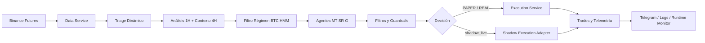

<div align="center">

# Pbot V5ARCH DEV

> **ES** Bot cuantitativo para Binance Futures con runtime modular, escaneo dinámico 1H, filtros estructurales, reconciliación segura y operación en modos `PAPER`, `REAL` y `shadow_live`.  
> **EN** Quantitative trading bot for Binance Futures with modular runtime, dynamic 1H scanning, structural filters, safe reconciliation and operation in `PAPER`, `REAL` and `shadow_live` modes.


**Trading bot con enfoque runtime-first: decisión, ejecución, reconciliación y observabilidad en una arquitectura modular.**  
**Runtime-first trading bot: decision, execution, reconciliation and observability in a modular architecture.**

`1H + 4H macro` • `BTC HMM regime` • `20x shadow exploration` • `Telegram ops` • `systemd` • `Docker`

</div>

---

## 🚀 Para Inversores y Colaboradores | For Investors and Collaborators

### 📈 Propuesta de Valor | Value Proposition

| ES | EN |
|---|---|
| Bot de trading cuantitativo diseñado para operar Binance Futures con enfoque en seguridad runtime y arquitectura modular. | Quantitative trading bot designed to operate on Binance Futures with focus on runtime safety and modular architecture. |
| Escaneo dinámico de mercado en 1H con contexto macro 4H, régimen HMM de BTC y filtros estructurales. | Dynamic market scanning on 1H with 4H macro context, BTC HMM regime and structural filters. |
| Separación clara entre lógica de decisión y ejecución, con adaptadores para modos reales y simulados. | Clear separation between decision logic and execution, with adapters for real and simulated modes. |
| Protección de posiciones reales mediante reconciliación, `HARD SL` y cierres de emergencia. | Real position protection through reconciliation, `HARD SL` and emergency close procedures. |

### ⚡ Operational Edge

| Edge | ES | EN |
|---|---|---|
| 🧬 Macro regime | BTC HMM dinámico con fallback heurístico y telemetría por pipeline | Dynamic BTC HMM with heuristic fallback and pipeline telemetry |
| 👻 Shadow lab | Hasta `20` operaciones shadow concurrentes para explorar sin tocar capital real | Up to `20` concurrent shadow trades to explore without touching real capital |
| 🧱 Tactical matrix | Matriz táctica exige muestra válida antes de bloquear símbolos | Tactical matrix requires valid samples before blocking symbols |
| 🧾 Audit trail | Eventos JSONL para señal, filtro, intención, fill y protección | JSONL events for signal, filter, intent, fill and protection |
| 📡 Live data | BTC por websocket con fallback REST y logging explícito de reconexión | BTC via websocket with REST fallback and explicit reconnect logging |

### 🏗️ Arquitectura en Resumen | Architecture at a Glance



### 🔍 Lo Más Destacado | Key Highlights

| Area | ES | EN |
|---|---|---|
| 📡 Triage dinámico | Escanea pares por liquidez, spread, volumen y latencia | Scans pairs by liquidity, spread, volume and latency |
| 🧠 Motor multi-agente | Combina votos `MT`, `SR` y `G` para la decisión final | Combines `MT`, `SR` and `G` agent votes for final decision |
| 🧬 Régimen HMM | Clasifica BTC en `BULL_TREND`, `BEAR_TREND` o `RANGE` con fallback heurístico | Classifies BTC as `BULL_TREND`, `BEAR_TREND` or `RANGE` with heuristic fallback |
| 🛡️ Seguridad runtime | Reconciliación, `HARD SL`, guardrails y cierre de emergencia | Reconciliation, `HARD SL`, guardrails and emergency close |
| 👻 Shadow execution | Simula rechazos, slippage y fills parciales con backend separado | Simulates rejections, slippage and partial fills with separated backend |
| 📲 Operación remota | Control, auditoría y diagnóstico vía comandos Telegram | Remote control, auditing and diagnostics via Telegram commands |
| 🐳 Despliegue | Ejecución local, `systemd` user y Docker | Local execution, `systemd` user and Docker |

### 🧱 Fases De Hardening Runtime | Runtime Hardening Phases

| Fase | ES | EN | Estado |
|---|---|---|---|
| 1 | Circuit Breaker diario UTC solo para `REAL` | UTC daily circuit breaker for `REAL` only | ✅ Publicado |
| 2 | Position sizing por distancia al `Stop Loss` | Stop-distance based position sizing | ✅ Publicado |
| 3 | Validación walk-forward para modelos | Walk-forward model validation | ✅ Publicado |
| 4 | Market Breadth interno con veto de LONG en `FEAR` | Internal Market Breadth with LONG veto during `FEAR` | ✅ Publicado |
| 5 | Filtro macro HMM, telemetría de pipeline y eventos de ciclo de ejecución | Macro HMM filter, pipeline telemetry and execution lifecycle events | ✅ Publicado |
| 6 | Exploración shadow ampliada, matriz táctica validada y limpieza de alertas pendientes | Expanded shadow exploration, validated tactical matrix and pending alert cleanup | ✅ Publicado |

---

## 📊 Dashboard Preview


---

## 🚀 Quick Start | Inicio Rápido

```bash
# ES: Clonar, preparar entorno y arrancar
git clone https://github.com/Rukawua26/Pbot-V5ARCH-DEV.git
cd Pbot-V5ARCH-DEV
python3 -m venv .venv
source .venv/bin/activate
pip install -r requirements.txt
# Crear .env con tus variables antes de arrancar
./.venv/bin/python main.py

# EN: Clone, setup environment and run
git clone https://github.com/Rukawua26/Pbot-V5ARCH-DEV.git
cd Pbot-V5ARCH-DEV
python3 -m venv .venv
source .venv/bin/activate
pip install -r requirements.txt
# Create .env with your variables before starting
./.venv/bin/python main.py
```

Antes de arrancar, crea `.env` manualmente con tus variables operativas y credenciales según el modo que vayas a usar.  
Before starting, manually create `.env` with your operational variables and credentials according to the mode you will use.

---

## 🧭 Navegación Rápida | Quick Navigation

| Ir a / Go to | Sección ES | Section EN |
|---|---|---|
| Inicio rápido | [Quick Start](#-quick-start--inicio-rpido) | [Quick Start](#-quick-start--inicio-rpido) |
| Modos de operación | [Modos Operativos](#-modos-operativos--operating-modes) | [Operating Modes](#-modos-operativos--operating-modes) |
| Arquitectura | [Arquitectura](#-arquitectura--architecture) | [Architecture](#-arquitectura--architecture) |
| Seguridad | [Seguridad Runtime](#-seguridad-runtime--runtime-safety) | [Runtime Safety](#-seguridad-runtime--runtime-safety) |
| Comandos | [Comandos Telegram](#-comandos-telegram-utiles--useful-telegram-commands) | [Telegram Commands](#-comandos-telegram-utiles--useful-telegram-commands) |
| Validación | [Validación Mínima](#-validacin-mnima--minimum-validation) | [Minimum Validation](#-validacin-mnima--minimum-validation) |

---

## 📡 Capacidades Actuales | Current Capabilities

| Area | Estado / Status | Detalle / Detail |
|---|---|---|
| Runtime modular | ✅ Activo / Active | `Bot`, `BotFacade`, ciclos, IO loops y monitorización desacoplados |
| Triage dinámico | ✅ Activo / Active | Top pares por liquidez, spread, volumen y latencia |
| Motor de señales | ✅ Activo / Active | Análisis 1H, veto macro 4H, votos de agentes y decisión final |
| Filtro régimen BTC | ✅ Activo / Active | HMM dinámico con fallback heurístico, penalización/range veto y pesos por régimen |
| Shadow exploration | ✅ Activo / Active | Límite default `MAX_SHADOW_TRADES=20` con override por `.env` |
| Matriz táctica | ✅ Activo / Active | Excluye `VETO_ERROR` y requiere muestra válida antes de bloquear/reducir símbolos |
| Breakout watchlist | ✅ Activo / Active | Seguimiento pasivo/semi-activo de oportunidades vetadas o en espera |
| Exit engine | ✅ Activo / Active | Salidas dinámicas, trailing ATR, breakeven y degradación de confianza |
| Reconciliación | ✅ Activo / Active | Recovery DB/exchange, intents, huérfanas, `LOST_IN_TRANSMISSION` |
| Ejecución segura | ✅ Activo / Active | `HARD SL`, cierres de emergencia y protecciones de runtime |
| Telemetría | ✅ Activo / Active | `logs/execution_events.jsonl`, runtime metrics y scorecards |
| Operación remota | ✅ Activo / Active | Comandos Telegram para auditoría, inteligencia y control |
| Docker/systemd | ✅ Disponible / Available | Despliegue en VPS o contenedor |

---

## 🎮 Modos Operativos | Operating Modes

| Modo / Mode | Configuración / Configuration | Comportamiento / Behavior |
|---|---|---|
| `PAPER` | `PAPER_MODE=true` | **ES:** Usa capital virtual. Si hay credenciales, valida conectividad; si no, puede seguir con endpoints públicos. <br> **EN:** Uses virtual capital. Validates connectivity if credentials exist; otherwise can continue with public endpoints. |
| `REAL` | `PAPER_MODE=false` | **ES:** Requiere credenciales y permisos válidos de Binance Futures; errores de auth/permisos abortan el arranque. <br> **EN:** Requires valid Binance Futures credentials and permissions; auth/permission errors abort startup. |
| `shadow_live` | `EXECUTION_BACKEND=shadow_live` | **ES:** Mantiene runtime real pero simula latencia, rechazo, slippage y fills parciales. <br> **EN:** Maintains real runtime but simulates latency, rejection, slippage and partial fills. |
| `TESTNET` | `USE_TESTNET=true` | **ES:** Activa sandbox cuando el backend lo soporta; en `PAPER` puede degradar a mercado público real para lecturas. <br> **EN:** Activates sandbox when backend supports it; in `PAPER` may degrade to real public market for reads. |

---

## 🏗️ Arquitectura | Architecture

### Runtime

```text
main.py
  -> core.bot_app.run_entrypoint()
      -> Bot(BotFacade)
         -> bootstrap de servicios, modelos, runtime state y loops
```

### Módulos Clave | Key Modules

| Ruta / Path | Rol / Role |
|---|---|
| `main.py` | **ES:** Entrypoint real del proceso <br> **EN:** Actual process entrypoint |
| `core/bot_app.py` | **ES:** Bootstrap pesado, clase `Bot`, event loop y wiring principal <br> **EN:** Heavy bootstrap, `Bot` class, event loop and main wiring |
| `core/bot_facade.py` | **ES:** Contrato público del runtime <br> **EN:** Public runtime contract |
| `core/bot_connection.py` | **ES:** Conexión a Binance y reglas por modo operativo <br> **EN:** Binance connection and rules per operating mode |
| `core/reconciliation.py` | **ES:** Recovery de estado DB/exchange al arranque <br> **EN:** DB/exchange state recovery at startup |
| `core/execution_adapters.py` | **ES:** Backends `live` y `shadow_live` <br> **EN:** `live` and `shadow_live` backends |
| `core/execution_service.py` | **ES:** Puerto de ejecución contra exchange <br> **EN:** Execution port against exchange |
| `core/bot_guardian.py` | **ES:** Vigilancia y protecciones sobre posiciones activas <br> **EN:** Monitoring and protections over active positions |
| `core/bot_wallet_sync.py` | **ES:** Sincronización de wallet y capital <br> **EN:** Wallet and capital synchronization |
| `core/bot_market_state.py` | **ES:** Detección de régimen BTC HMM/heurística <br> **EN:** BTC HMM/heuristic regime detection |
| `core/command_router.py` | **ES:** Router de comandos Telegram <br> **EN:** Telegram command router |
| `core/signals/` | **ES:** Contexto, análisis, filtros y ejecución de señales <br> **EN:** Context, analysis, filters and signal execution |
| `core/strategy/` | **ES:** Agentes, consenso y filtros de estrategia <br> **EN:** Agents, consensus and strategy filters |
| `tests/` | **ES:** Regresiones runtime, guardrails y contratos <br> **EN:** Runtime regressions, guardrails and contracts |

---

## 🛡️ Seguridad Runtime | Runtime Safety

- **ES:** El exchange manda sobre la DB para exposición real y estado de ordenes/posiciones.
- **EN:** Exchange overrides DB for real exposure and order/position state.

- **ES:** No se dejan posiciones reales sin `HARD SL`.
- **EN:** Real positions are never left without `HARD SL`.

- **ES:** Si el `HARD SL` no puede re-adjuntarse por rechazo tipo `would trigger immediately (-2021)`, el bot ejecuta `Emergency Market Close`.
- **EN:** If `HARD SL` cannot be re-attached due to `would trigger immediately (-2021)` rejection, bot executes `Emergency Market Close`.

- **ES:** `LOST_IN_TRANSMISSION` solo se declara tras agotar verificación en posiciones activas, ordenes abiertas y consulta por `origClientOrderId`.
- **EN:** `LOST_IN_TRANSMISSION` only declared after exhausting verification on active positions, open orders and query by `origClientOrderId`.

- **ES:** Si el estado live queda ambiguo, el comportamiento esperado es `HALT` o reconciliación antes de continuar.
- **EN:** If live state becomes ambiguous, expected behavior is `HALT` or reconciliation before continuing.

- **ES:** Hay guardrail para bloquear `pass` silenciosos en `core/` mediante CI.
- **EN:** Guardrail exists to block silent `pass` in `core/` via CI.

### Estados Runtime De Orden/Trade | Order/Trade Runtime States

- `PENDING_SEND`
- `PENDING_EXCHANGE_OPEN`
- `ENTRY_FILLED_AWAITING_POSITION_SYNC`
- `OPEN`
- `CLOSING_INITIATED`

---

## ⚙️ Configuración | Configuration

`.env` se carga automáticamente desde `core/config/operational.py`.  
`.env` is automatically loaded from `core/config/operational.py`.

### Variables Importantes | Important Variables

| Variable | Uso / Usage |
|---|---|
| `BINANCE_API_KEY`, `BINANCE_API_SECRET` | **ES:** Credenciales Binance Futures <br> **EN:** Binance Futures credentials |
| `PAPER_MODE` | **ES:** Alterna `PAPER`/`REAL` <br> **EN:** Toggles `PAPER`/`REAL` |
| `PAPER_INITIAL_BALANCE` | **ES:** Capital virtual inicial <br> **EN:** Initial virtual capital |
| `USE_TESTNET` | **ES:** Sandbox/testnet cuando el backend lo soporta <br> **EN:** Sandbox/testnet when backend supports it |
| `EXECUTION_BACKEND` | **ES:** `live` o `shadow_live` <br> **EN:** `live` or `shadow_live` |
| `MAX_SHADOW_TRADES` | **ES:** Máximo de operaciones shadow concurrentes; default `20` <br> **EN:** Max concurrent shadow trades; default `20` |
| `TELEGRAM_TOKEN`, `TELEGRAM_CHAT_ID` | **ES:** Operación remota y alertas <br> **EN:** Remote operation and alerts |
| `TRIAGE_MAX_WORKERS` | **ES:** Concurrencia del escaneo <br> **EN:** Scan concurrency |
| `PARTIAL_FILL_TIMEOUT_SECONDS` | **ES:** Timeout para fills parciales <br> **EN:** Timeout for partial fills |
| `PENDING_SEND_STALE_SECONDS` | **ES:** Expiración de intents huérfanas <br> **EN:** Orphan intent expiration |
| `GLOBAL_ENTRY_COOLDOWN_SECONDS` | **ES:** Cooldown global de entradas <br> **EN:** Global entry cooldown |
| `HARD_SL_ATTACH_MAX_RETRIES` | **ES:** Reintentos para adjuntar stop loss <br> **EN:** Retries to attach stop loss |
| `WATCHDOG_HEARTBEAT_PATH` | **ES:** Ruta del heartbeat del watchdog <br> **EN:** Watchdog heartbeat path |
| `HMM_REGIME_ENABLED` | **ES:** Activa filtro de régimen BTC HMM <br> **EN:** Enables BTC HMM regime filter |
| `HMM_RANGE_VETO` | **ES:** Bloquea entradas reales en régimen `RANGE` cuando aplica <br> **EN:** Blocks real entries in `RANGE` regime when applicable |
| `HMM_RANGE_PENALTY` | **ES:** Penalización de probabilidad en rango para aprendizaje/shadow <br> **EN:** Probability penalty in range for learning/shadow |
| `WS_TICKER_MAX_AGE_SECONDS` | **ES:** Edad máxima de precio BTC por websocket antes de fallback REST <br> **EN:** Max websocket BTC price age before REST fallback |

### Variables Para `shadow_live`

- `SHADOW_SIM_LATENCY_MIN_MS`
- `SHADOW_SIM_LATENCY_MAX_MS`
- `SHADOW_SIM_REJECT_RATE`
- `SHADOW_SIM_PARTIAL_FILL_RATE`
- `SHADOW_SIM_PARTIAL_COMPLETE_RATE`
- `SHADOW_SIM_PRICE_OUT_OF_RANGE_RATE`
- `SHADOW_SIM_MIN_PARTIAL_RATIO`

---

## 📦 Instalación | Installation

```bash
# ES y EN / ES and EN
python3 -m venv .venv
source .venv/bin/activate
pip install -r requirements.txt
```

### Stack Principal | Main Stack

- `ccxt`
- `pandas`
- `ta`, `pandas_ta`
- `scikit-learn`, `xgboost`, `lightgbm`, `imbalanced-learn`
- `hmmlearn`
- `requests`, `websockets`, `websocket-client`
- `optuna`

---

## 🚀 Puesta En Marcha | Deployment

### Local

```bash
./.venv/bin/python main.py
```

### systemd User

```bash
bash tools/install_watchdog_systemd.sh
systemctl --user status sniper-ai.service --no-pager
```

Plantillas portables disponibles / Available portable templates:

- `deploy/systemd/sniper-ai.service.template`
- `deploy/systemd/sniper-ai-watchdog.service.template`

### Docker

```bash
docker compose up --build -d
```

**ES:** Notas del despliegue Docker actual: imagen base `python:3.12-slim`, usuario no root, persistencia en `./data/db` y `./data/models`, `SNIPER_DB_PATH=/app/data/sniper_brain.db`.  
**EN:** Current Docker deployment notes: base image `python:3.12-slim`, non-root user, persistence in `./data/db` and `./data/models`, `SNIPER_DB_PATH=/app/data/sniper_brain.db`.

---

## 📊 Operación Diaria | Daily Operations

| Tarea / Task | Comando / Command |
|---|---|
| **ES:** Ver estado <br> **EN:** View status | `systemctl --user status sniper-ai.service --no-pager` |
| **ES:** Iniciar <br> **EN:** Start | `systemctl --user start sniper-ai.service` |
| **ES:** Detener <br> **EN:** Stop | `systemctl --user stop sniper-ai.service` |
| **ES:** Reiniciar <br> **EN:** Restart | `systemctl --user restart sniper-ai.service` |
| **ES:** Logs en vivo <br> **EN:** Live logs | `journalctl --user -u sniper-ai.service -f` |
| **ES:** Últimos logs <br> **EN:** Recent logs | `journalctl --user -u sniper-ai.service -n 100 --no-pager` |
| **ES:** Reinstalar servicio <br> **EN:** Reinstall service | `bash tools/install_watchdog_systemd.sh` |
| **ES:** Actualizar dependencias <br> **EN:** Update dependencies | `source .venv/bin/activate && pip install -r requirements.txt` |

---

## 📡 Telemetría Y Observabilidad | Telemetry and Observability

- **ES:** `sniper.log`: log operativo principal. <br> **EN:** `sniper.log`: main operational log.
- **ES:** `logs/execution_events.jsonl`: eventos estructurados de ejecución. <br> **EN:** `logs/execution_events.jsonl`: structured execution events.
- **ES:** Runtime monitor con métricas de memoria y salud del proceso. <br> **EN:** Runtime monitor with memory metrics and process health.
- **ES:** Estado de pipeline con fuente de precio BTC, edad WS, régimen HMM y confianza. <br> **EN:** Pipeline state with BTC price source, WS age, HMM regime and confidence.
- **ES:** Websocket BTC loguea conexión inicial, cierre y reconexión para detectar degradación de datos en vivo. <br> **EN:** BTC websocket logs initial connection, close and reconnect to detect live-data degradation.
- **ES:** Alertas `PENDING` se descartan cuando una entrada es bloqueada antes de enviar orden. <br> **EN:** `PENDING` alerts are discarded when an entry is blocked before order send.
- **ES:** Scorecards y reportes de rendimiento diarios. <br> **EN:** Daily scorecards and performance reports.
- **ES:** `watchdog` y heartbeat para supervisión externa. <br> **EN:** `watchdog` and heartbeat for external supervision.

### Eventos De Ejecución Relevantes | Relevant Execution Events

- `ENTRY_ORDER_ACK`
- `ORDER_INTENT_CREATED`
- `ORDER_FILLED`
- `ORDER_PROTECTION_ATTACHED`
- `SIGNAL_ANALYZED`
- `SIGNAL_EXECUTION_SELECTED`
- `SIGNAL_EXECUTION_RESULT`
- `FILTER_APPLIED`
- `RANGE_VETO`
- `RANGE_PENALTY`
- `PENDING_SEND_PERSISTED`
- `PARTIAL_FILL_COMPLETED`
- `PARTIAL_FILL_TIMEOUT_CANCEL`
- `PARTIAL_FILL_CANCEL_FAILED`
- `EMERGENCY_CLOSE_EXECUTED`
- `EMERGENCY_CLOSE_FAILED_HALT`

---

## 📲 Comandos Telegram Utiles | Useful Telegram Commands

### Control

- `/on`, `/resume`
- `/off`, `/pause`
- `/panic`, `/closeall`
- `/reset`
- `/rebase_capital`
- `/test`

### Auditoría | Auditing

- `/status`
- `/audit_report`
- `/open`
- `/targets`
- `/signals`
- `/pipeline`
- `/shadow_stats`
- `/sre_intent`
- `/tiers`
- `/top`

### Análisis E Inteligencia | Analysis and Intelligence

- `/trade_detail <symbol>`
- `/trade <id>`
- `/thinking`
- `/watchlist`
- `/intelligence`
- `/agents`
- `/explain <symbol>`
- `/dna <symbol>`
- `/paper_review`
- `/performance_trends`
- `/shadow_report`

**ES:** Algunos comandos heredados o remotos fueron deshabilitados a propósito en este despliegue para evitar ejecuciones falsas o dependencias ausentes.  
**EN:** Some inherited or remote commands were intentionally disabled in this deployment to avoid false executions or missing dependencies.

---

## ✅ Validación Mínima | Minimum Validation

Orden base alineado con CI / Base order aligned with CI:

```bash
./.venv/bin/python -m compileall -q main.py core
PATH="/home/miguel/Pbot-V5ARCH-DEV/.venv/bin:$PATH" bash scripts/smoke_modular_imports.sh
./.venv/bin/python tools/check_no_silent_pass.py
./.venv/bin/python tools/regression_contracts.py
./.venv/bin/python -m unittest discover -s tests -p "test_*.py"
./.venv/bin/python -m unittest tests/test_temporal_invariance.py
```

### Cobertura Destacada En `tests/` | Highlighted Coverage in `tests/`

- **ES:** reconciliación y wallet sync <br> **EN:** reconciliation and wallet sync
- **ES:** contratos de adaptadores de ejecución <br> **EN:** execution adapter contracts
- **ES:** flows avanzados de runtime <br> **EN:** advanced runtime flows
- **ES:** filtro HMM de régimen BTC y fallback heurístico <br> **EN:** BTC HMM regime filter and heuristic fallback
- **ES:** telemetría de pipeline BTC por websocket y REST <br> **EN:** BTC pipeline telemetry via websocket and REST
- **ES:** matriz táctica, límite shadow y descarte de alertas pendientes <br> **EN:** tactical matrix, shadow limit and pending alert discard
- **ES:** watchdog y graceful shutdown <br> **EN:** watchdog and graceful shutdown
- **ES:** guardrails de riesgo, leverage y smart exit <br> **EN:** risk guardrails, leverage and smart exit
- **ES:** invariancia temporal y seguridad runtime <br> **EN:** temporal invariance and runtime safety

---

## 📁 Estructura Del Proyecto | Project Structure

```text
.
|-- main.py
|-- core/
|   |-- bot_app.py
|   |-- bot_facade.py
|   |-- reconciliation.py
|   |-- execution_adapters.py
|   |-- commands/
|   |-- config/
|   `-- strategy/
|-- tests/
|-- tools/
|-- deploy/systemd/
|-- docs/runbooks/
|-- docs/images/
|-- Dockerfile
`-- docker-compose.yml
```

---

## 📚 Documentación Adicional | Additional Documentation

- `CONTRIBUTING.md`
- `SECURITY.md`
- `SPEC.md`
- `BOT_TECHNICAL_ROADMAP.md`
- `RELEASE_FREEZE_REPORT_2026-04-01.md`
- `docs/runbooks/sre-intent-recovery.md`

---

## 📸 Notas De Render Para GitHub | GitHub Render Notes

- **ES:** El diagrama Mermaid se renderiza de forma nativa en GitHub. <br> **EN:** Mermaid diagrams render natively on GitHub.
- **ES:** Si más adelante agregas capturas reales del dashboard o reportes, la ruta natural sería `docs/images/`. <br> **EN:** If you later add real dashboard screenshots or reports, the natural path would be `docs/images/`.
- **ES:** Conviene evitar imágenes inventadas o enlaces rotos en portada; por eso este README usa badges y Mermaid como base visual. <br> **EN:** Avoid fake images or broken links on the landing page; that's why this README uses badges and Mermaid as visual base.

---

## 🔒 Seguridad Del Repo | Repo Security

- **ES:** No subas `.env`, bases `.db`, logs, modelos binarios ni reportes generados con datos locales. <br> **EN:** Do not push `.env`, `.db` bases, logs, binary models or reports generated with local data.
- **ES:** Usa secretos de entorno o gestor de secretos del servidor para credenciales. <br> **EN:** Use environment secrets or server secret manager for credentials.
- **ES:** Antes de operar en `REAL`, valida permisos de Futures, tamaño de cuenta y rutas de recovery. <br> **EN:** Before operating in `REAL`, validate Futures permissions, account size and recovery paths.
