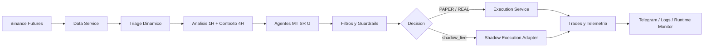

# Pbot V5ARCH DEV

> Bot cuantitativo para Binance Futures con runtime modular, escaneo dinamico 1H, filtros estructurales, reconciliacion segura y operacion en modos `PAPER`, `REAL` y `shadow_live`.


## Visión General

`Pbot V5ARCH DEV` esta orientado a operar Binance Futures con un enfoque de seguridad runtime primero:

- analiza mercado en `1H` con contexto macro `4H`
- filtra oportunidades por liquidez, spread, latencia y estructura
- separa claramente la logica de decision de la logica de ejecucion
- protege posiciones reales con reconciliacion, `HARD SL` y cierres de emergencia
- expone operacion y auditoria por Telegram, logs y telemetria estructurada

## Lo Más Destacado

| Area | Que aporta |
|---|---|
| 📡 Triage dinamico | Escanea pares por liquidez, spread, volumen y latencia |
| 🧠 Motor multi-agente | Combina votos `MT`, `SR` y `G` para la decision final |
| 🛡️ Seguridad runtime | Reconciliacion, `HARD SL`, guardrails y cierre de emergencia |
| 👻 Shadow execution | Simula rechazos, slippage y fills parciales con backend separado |
| 📲 Operacion remota | Control, auditoria y diagnostico via comandos Telegram |
| 🐳 Despliegue | Ejecucion local, `systemd` user y Docker |

## Flujo De Alto Nivel



## Capacidades Actuales

| Area | Estado | Detalle |
|---|---|---|
| Runtime modular | Activo | `Bot`, `BotFacade`, ciclos, IO loops y monitorizacion desacoplados |
| Triage dinamico | Activo | Top pares por liquidez, spread, volumen y latencia |
| Motor de senales | Activo | Analisis 1H, veto macro 4H, votos de agentes y decision final |
| Breakout watchlist | Activo | Seguimiento pasivo/semi-activo de oportunidades vetadas o en espera |
| Exit engine | Activo | Salidas dinamicas, trailing ATR, breakeven y degradacion de confianza |
| Reconciliacion | Activo | Recovery DB/exchange, intents, orfanas, `LOST_IN_TRANSMISSION` |
| Ejecucion segura | Activo | `HARD SL`, cierres de emergencia y protecciones de runtime |
| Telemetria | Activo | `logs/execution_events.jsonl`, runtime metrics y scorecards |
| Operacion remota | Activo | Comandos Telegram para auditoria, inteligencia y control |
| Docker/systemd | Disponible | Despliegue en VPS o contenedor |

## Modos Operativos

| Modo | Configuracion | Comportamiento |
|---|---|---|
| `PAPER` | `PAPER_MODE=true` | Usa capital virtual. Si hay credenciales, valida conectividad; si no, puede seguir con endpoints publicos. |
| `REAL` | `PAPER_MODE=false` | Requiere credenciales y permisos validos de Binance Futures; errores de auth/permisos abortan el arranque. |
| `shadow_live` | `EXECUTION_BACKEND=shadow_live` | Mantiene runtime real pero simula latencia, rechazo, slippage y fills parciales. |
| `TESTNET` | `USE_TESTNET=true` | Activa sandbox cuando el backend lo soporta; en `PAPER` puede degradar a mercado publico real para lecturas. |

## Arquitectura

### Runtime

```text
main.py
  -> core.bot_app.run_entrypoint()
     -> Bot(BotFacade)
        -> bootstrap de servicios, modelos, runtime state y loops
```

### Modulos Clave

| Ruta | Rol |
|---|---|
| `main.py` | Entrypoint real del proceso |
| `core/bot_app.py` | Bootstrap pesado, clase `Bot`, event loop y wiring principal |
| `core/bot_facade.py` | Contrato publico del runtime |
| `core/bot_connection.py` | Conexion a Binance y reglas por modo operativo |
| `core/reconciliation.py` | Recovery de estado DB/exchange al arranque |
| `core/execution_adapters.py` | Backends `live` y `shadow_live` |
| `core/execution_service.py` | Puerto de ejecucion contra exchange |
| `core/bot_guardian.py` | Vigilancia y protecciones sobre posiciones activas |
| `core/bot_wallet_sync.py` | Sincronizacion de wallet y capital |
| `core/command_router.py` | Router de comandos Telegram |
| `core/signals/` | Contexto, analisis, filtros y ejecucion de senales |
| `core/strategy/` | Agentes, consenso y filtros de estrategia |
| `tests/` | Regresiones runtime, guardrails y contratos |

## Seguridad Runtime

- El exchange manda sobre la DB para exposicion real y estado de ordenes/posiciones.
- No se dejan posiciones reales sin `HARD SL`.
- Si el `HARD SL` no puede re-adjuntarse por rechazo tipo `would trigger immediately (-2021)`, el bot ejecuta `Emergency Market Close`.
- `LOST_IN_TRANSMISSION` solo se declara tras agotar verificacion en posiciones activas, ordenes abiertas y consulta por `origClientOrderId`.
- Si el estado live queda ambiguo, el comportamiento esperado es `HALT` o reconciliacion antes de continuar.
- Hay guardrail para bloquear `pass` silenciosos en `core/` mediante CI.

### Estados Runtime De Orden/Trade

- `PENDING_SEND`
- `PENDING_EXCHANGE_OPEN`
- `ENTRY_FILLED_AWAITING_POSITION_SYNC`
- `OPEN`
- `CLOSING_INITIATED`

## Configuracion

`.env` se carga automaticamente desde `core/config/operational.py`.

### Variables Importantes

| Variable | Uso |
|---|---|
| `BINANCE_API_KEY`, `BINANCE_API_SECRET` | Credenciales Binance Futures |
| `PAPER_MODE` | Alterna `PAPER`/`REAL` |
| `PAPER_INITIAL_BALANCE` | Capital virtual inicial |
| `USE_TESTNET` | Sandbox/testnet cuando el backend lo soporta |
| `EXECUTION_BACKEND` | `live` o `shadow_live` |
| `TELEGRAM_TOKEN`, `TELEGRAM_CHAT_ID` | Operacion remota y alertas |
| `TRIAGE_MAX_WORKERS` | Concurrencia del escaneo |
| `PARTIAL_FILL_TIMEOUT_SECONDS` | Timeout para fills parciales |
| `PENDING_SEND_STALE_SECONDS` | Expiracion de intents huerfanas |
| `GLOBAL_ENTRY_COOLDOWN_SECONDS` | Cooldown global de entradas |
| `HARD_SL_ATTACH_MAX_RETRIES` | Reintentos para adjuntar stop loss |
| `WATCHDOG_HEARTBEAT_PATH` | Ruta del heartbeat del watchdog |

### Variables Para `shadow_live`

- `SHADOW_SIM_LATENCY_MIN_MS`
- `SHADOW_SIM_LATENCY_MAX_MS`
- `SHADOW_SIM_REJECT_RATE`
- `SHADOW_SIM_PARTIAL_FILL_RATE`
- `SHADOW_SIM_PARTIAL_COMPLETE_RATE`
- `SHADOW_SIM_PRICE_OUT_OF_RANGE_RATE`
- `SHADOW_SIM_MIN_PARTIAL_RATIO`

## Instalacion

```bash
python3 -m venv .venv
source .venv/bin/activate
pip install -r requirements.txt
```

### Stack Principal

- `ccxt`
- `pandas`
- `ta`, `pandas_ta`
- `scikit-learn`, `xgboost`, `lightgbm`, `imbalanced-learn`
- `requests`, `websockets`, `websocket-client`
- `optuna`

## Puesta En Marcha

### Local

```bash
./.venv/bin/python main.py
```

### systemd User

```bash
bash tools/install_watchdog_systemd.sh
systemctl --user status sniper-ai.service --no-pager
```

Plantillas portables disponibles:

- `deploy/systemd/sniper-ai.service.template`
- `deploy/systemd/sniper-ai-watchdog.service.template`

### Docker

```bash
docker compose up --build -d
```

Notas del despliegue Docker actual:

- Imagen base `python:3.12-slim`
- Usuario no root
- Persistencia en `./data/db` y `./data/models`
- `SNIPER_DB_PATH=/app/data/sniper_brain.db`

## Quick Start

```bash
python3 -m venv .venv
source .venv/bin/activate
pip install -r requirements.txt
./.venv/bin/python main.py
```

Antes de arrancar, crea `.env` manualmente con tus variables operativas y credenciales segun el modo que vayas a usar.

## Operacion Diaria

| Tarea | Comando |
|---|---|
| Ver estado | `systemctl --user status sniper-ai.service --no-pager` |
| Iniciar | `systemctl --user start sniper-ai.service` |
| Detener | `systemctl --user stop sniper-ai.service` |
| Reiniciar | `systemctl --user restart sniper-ai.service` |
| Logs en vivo | `journalctl --user -u sniper-ai.service -f` |
| Ultimos logs | `journalctl --user -u sniper-ai.service -n 100 --no-pager` |
| Reinstalar servicio | `bash tools/install_watchdog_systemd.sh` |
| Actualizar dependencias | `source .venv/bin/activate && pip install -r requirements.txt` |

## Telemetria Y Observabilidad

- `sniper.log`: log operativo principal.
- `logs/execution_events.jsonl`: eventos estructurados de ejecucion.
- Runtime monitor con metricas de memoria y salud del proceso.
- Scorecards y reportes de rendimiento diarios.
- `watchdog` y heartbeat para supervision externa.

### Eventos De Ejecucion Relevantes

- `ENTRY_ORDER_ACK`
- `PARTIAL_FILL_COMPLETED`
- `PARTIAL_FILL_TIMEOUT_CANCEL`
- `PARTIAL_FILL_CANCEL_FAILED`
- `EMERGENCY_CLOSE_EXECUTED`
- `EMERGENCY_CLOSE_FAILED_HALT`

## Comandos Telegram Utiles

### Control

- `/on`, `/resume`
- `/off`, `/pause`
- `/panic`, `/closeall`
- `/reset`
- `/rebase_capital`
- `/test`

### Auditoria

- `/status`
- `/audit_report`
- `/open`
- `/targets`
- `/signals`
- `/shadow_stats`
- `/sre_intent`
- `/tiers`
- `/top`

### Analisis E Inteligencia

- `/trade_detail <symbol>`
- `/trade <id>`
- `/thinking`
- `/watchlist`
- `/intelligence`
- `/agents`
- `/explain <symbol>`
- `/dna <symbol>`
- `/paper_review`
- `/performance_trends`
- `/shadow_report`

Algunos comandos heredados o remotos fueron deshabilitados a proposito en este despliegue para evitar ejecuciones falsas o dependencias ausentes.

## Validacion Minima

Orden base alineado con CI:

```bash
./.venv/bin/python -m compileall -q main.py core
PATH="/home/miguel/Pbot-V5ARCH-DEV/.venv/bin:$PATH" bash scripts/smoke_modular_imports.sh
./.venv/bin/python tools/check_no_silent_pass.py
./.venv/bin/python tools/regression_contracts.py
./.venv/bin/python -m unittest discover -s tests -p "test_*.py"
./.venv/bin/python -m unittest tests/test_temporal_invariance.py
```

### Cobertura Destacada En `tests/`

- reconciliacion y wallet sync
- contratos de adaptadores de ejecucion
- flows avanzados de runtime
- watchdog y graceful shutdown
- guardrails de riesgo, leverage y smart exit
- invariancia temporal y seguridad runtime

## Estructura Del Proyecto

```text
.
|-- main.py
|-- core/
|   |-- bot_app.py
|   |-- bot_facade.py
|   |-- reconciliation.py
|   |-- execution_adapters.py
|   |-- commands/
|   |-- config/
|   `-- strategy/
|-- tests/
|-- tools/
|-- deploy/systemd/
|-- docs/runbooks/
|-- Dockerfile
`-- docker-compose.yml
```

## Documentacion Adicional

- `CONTRIBUTING.md`
- `SECURITY.md`
- `SPEC.md`
- `BOT_TECHNICAL_ROADMAP.md`
- `RELEASE_FREEZE_REPORT_2026-04-01.md`
- `docs/runbooks/sre-intent-recovery.md`

## Notas De Render Para GitHub

- El diagrama Mermaid se renderiza de forma nativa en GitHub.
- Si mas adelante agregas capturas reales del dashboard o reportes, la ruta natural seria `docs/images/`.
- Conviene evitar imagenes inventadas o enlaces rotos en portada; por eso este README usa badges y Mermaid como base visual.

## Seguridad Del Repo

- No subas `.env`, bases `.db`, logs, modelos binarios ni reportes generados con datos locales.
- Usa secretos de entorno o gestor de secretos del servidor para credenciales.
- Antes de operar en `REAL`, valida permisos de Futures, tamaño de cuenta y rutas de recovery.
